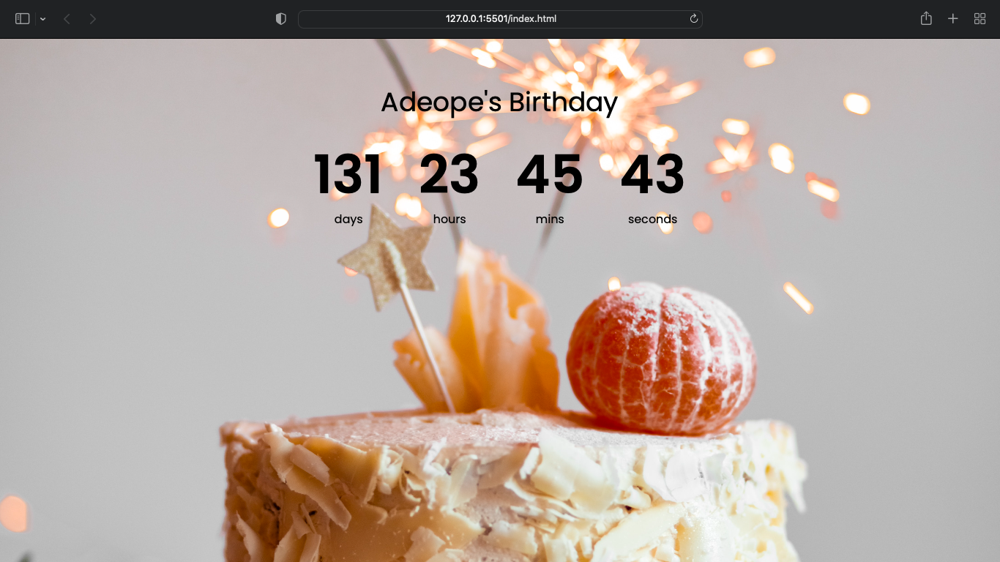

# COUNTDOWN APP

This is a Countdown app till my birthday August 15 2023

## Table of contents

- [Screenshot](#screenshot)
- [Links](#links)
- [Built with](#built-with)
- [What I learned](#what-i-learned)
- [Author](#author)
- [Acknowledgments](#acknowledgments)

**Note: Delete this note and update the table of contents based on what sections you keep.**


### Screenshot



### Built with

- Semantic HTML5 markup
- CSS custom properties
- Flexbox
- CSS Grid
-Vanilla JS


### What I learned

I learnt the use of SetInterval which is called by using (SetInterval,1000) which means To do the same action in 1000ms

To see how you can add code snippets, see below:

```html
  <div class="element days-c">
    <p class="big-text" id="days">0</p>
  <span>days</span>
```
```js
    const total_seconds = (newYearsDate - currentDate) / 1000;

```


## Author

- Website - [Adefila Mustapha](https://www.adeope.org)
- Twitter - [@adeope63](https://www.twitter.com/adeope63)


## Acknowledgments

I want to say a big thank you to Florin Pop for giving me this opportunity to prove myself and improve my skills in JS and CSS with this task.
